<p align="center">
  
</p>

<h1 align="center">DashboardModern v2</h1>

<p align="center">
  <strong>La dashboard completa per Home Assistant: si configura a video, funziona su telefono, tablet e desktop.</strong><br>
  Persone · Stanze · Energia · Fotovoltaico · Batteria · Elettrodomestici · Auto elettrica · Luci · Clima · Temperatura · Tapparelle · Sicurezza · Solare termico · Piscina · Irrigazione · Aspirapolvere · Server
</p>

<p align="center">
  
  <a href="https://github.com/danigio15/dashboardmodern-v2/releases"></a>
  <a href="https://github.com/danigio15/dashboardmodern-v2/actions/workflows/tests.yml"></a>
  <a href="https://github.com/danigio15/dashboardmodern-v2/releases"></a>
  <a href="https://www.paypal.com/paypalme/giovannidaniello15"></a>
  
  
  
  <a href="LICENSE"></a>
</p>

<p align="center">
  <a href="#installazione">Installazione</a> ·
  <a href="#anteprima-sezione-per-sezione">Anteprime</a> ·
  <a href="#editor-dashboard-tutte-le-configurazioni">Configurazioni</a> ·
  <a href="#potenzialità">Potenzialità</a> ·
  <a href="CHANGELOG.md">Changelog</a> ·
  <a href="#risoluzione-problemi">Problemi</a> ·
  <a href="#supporta-il-progetto">Sostieni il progetto</a>
</p>

<p align="center">
  
  
</p>

<table>
<tr>
<td width="30%"></td>
<td width="70%">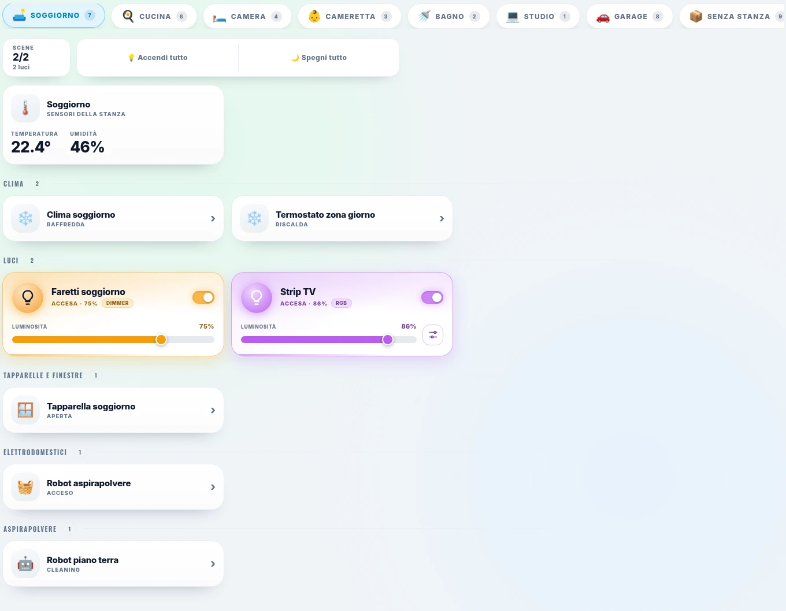</td>
</tr>
</table>

---

## Cos'è DashboardModern

**DashboardModern v2** è una custom integration per Home Assistant che aggiunge alla barra laterale una **plancia completa**, già pronta per l'uso quotidiano, che si configura interamente a video.

Le entità restano entità Home Assistant: DashboardModern si occupa di presentazione, aggregazioni, storico e comandi. Non serve costruire decine di card Lovelace, non serve scrivere YAML.

- **Nessun token da incollare, nessun file da scaricare, nessun `configuration.yaml` da modificare.** Il pannello passa alla plancia la sessione già autenticata di Home Assistant.
- **Tutto si configura dall'editor visuale**, dentro la plancia stessa: ventidue schede, un pulsante di salvataggio per pannello.
- **La configurazione vive dentro Home Assistant**, in un archivio condiviso dell'integrazione: la stessa per tutti gli utenti e per tutti i dispositivi, con backup e ripristino da file.
- **Due modi di guardare la casa**: per tipo — tutte le luci, tutte le tapparelle — oppure **per stanza**, con una pagina per ogni ambiente.
- **Italiano e inglese**, scelti dalla lingua del profilo Home Assistant.
- **Nessuna dipendenza da internet**: marchi delle auto, ritratti delle persone e icone stanno dentro l'integrazione.

---

## Indice

- [Requisiti](#requisiti)
- [Installazione](#installazione)
- [Configurazione dell'integrazione](#configurazione-dellintegrazione)
- [Prima configurazione della plancia](#prima-configurazione-della-plancia)
- [Dove vive la configurazione](#dove-vive-la-configurazione)
- [Anteprima sezione per sezione](#anteprima-sezione-per-sezione)
  - [Home](#home) · [Stanze](#stanze) · [Navigazione](#navigazione) · [Energia](#energia) · [Elettrodomestici](#elettrodomestici) · [Auto elettrica](#auto-elettrica-e-wallbox) · [Luci](#luci) · [Clima](#clima) · [Temperatura](#temperatura-e-umidità) · [Tapparelle](#tapparelle-tende-e-finestre) · [Sicurezza](#sicurezza-telecamere-e-aperture) · [Solare termico](#solare-termico) · [Piscina](#piscina) · [Irrigazione](#irrigazione) · [Aspirapolvere](#aspirapolvere) · [MiniPC](#minipc-e-rete)
- [Editor Dashboard: tutte le configurazioni](#editor-dashboard-tutte-le-configurazioni)
  - [Autorilevamento entità](#autorilevamento-entità)
- [Come vengono calcolati i numeri](#come-vengono-calcolati-i-numeri)
- [Potenzialità](#potenzialità)
- [Architettura in breve](#architettura-in-breve)
- [Sviluppo, test e anteprime](#sviluppo-test-e-anteprime)
- [Risoluzione problemi](#risoluzione-problemi)
- [Documentazione del progetto](#documentazione-del-progetto)
- [Download e diffusione](#download-e-diffusione)
- [Supporta il progetto](#supporta-il-progetto)

---

## Requisiti

| Requisito | Valore |
| --- | --- |
| Home Assistant | **2025.1.0** o successivo |
| Installazione | HACS come *custom repository* (tipo: Integrazione), oppure copia manuale in `custom_components/` |
| Consigliato | `recorder` attivo: serve per storico, report e analisi Energia |
| Browser | qualsiasi browser moderno; app Companion iOS e Android supportate |
| Entità | le tue: DashboardModern **non crea** entità, usa quelle già presenti in Home Assistant |
| Rete | nessuna connessione a internet richiesta a runtime |

---

## Installazione

### Con HACS (consigliato)

1. Apri **HACS** in Home Assistant.
2. Menu in alto a destra → **Archivi personalizzati** / *Custom repositories*.
3. Inserisci l'URL del repository e scegli il tipo **Integrazione**:

   ```text
   https://github.com/danigio15/dashboardmodern-v2
   ```

4. Cerca **DashboardModern v2** e installa la versione più recente.
5. **Riavvia Home Assistant.**
6. **Impostazioni → Dispositivi e servizi → Aggiungi integrazione → Dashboard Modern V2**.
7. Dai un nome alla plancia e conferma.
8. Apri **DashboardModern** dalla barra laterale.

### Installazione manuale

1. Copia la cartella `custom_components/dashboardmodern/` nella tua `config/custom_components/`.
2. Riavvia Home Assistant e aggiungi l'integrazione dal passo 6 qui sopra.

### Dopo un aggiornamento

Gli asset del frontend sono pubblicati su un URL versionato con il **digest del contenuto** (`/dashboardmodern_static/<digest>/…`): quando aggiorni, l'URL cambia e il browser scarica la versione nuova senza hard refresh. Serve comunque:

1. riavviare Home Assistant quando HACS mostra **In attesa di riavvio**;
2. sull'app Companion, chiuderla e riaprirla se resta visibile la versione precedente.

---

## Configurazione dell'integrazione

### Creazione della plancia

Ogni plancia è una **config entry**: puoi averne più di una, con configurazioni indipendenti. Alla creazione scegli il nome, che diventa il titolo nella barra laterale.

### Opzioni (Configura)

**Impostazioni → Dispositivi e servizi → `Dashboard Modern V2` → Configura**

| Opzione | Cosa fa |
| --- | --- |
| **Nome** | titolo del pannello nella barra laterale |
| **Icona** | icona del pannello |
| **Utenti abilitati** | limita la visibilità della plancia ad alcuni account Home Assistant |
| **Posizione nella barra** | ordine rispetto alle altre voci |

### Cosa registra l'integrazione

- un **pannello** nella barra laterale che serve la plancia;
- un percorso statico versionato per gli asset del frontend;
- i **comandi WebSocket** dell'archivio condiviso (`dashboardmodern/config/get`, `set`, `restore`);
- i **ritratti** e i **marchi delle auto**, serviti localmente.

Non crea entità, non scrive su `configuration.yaml`, non contatta nessun servizio esterno.

---

## Prima configurazione della plancia

Apri **DashboardModern** dalla barra laterale, poi **Editor Dashboard**.

> **Scorciatoia consigliata.** In **⚙️ Impostazioni** c'è il pulsante **🪄 Avvia autorilevamento**: analizza tutte le entità di Home Assistant, propone luci, stanze, unità clima, telecamere e collegamenti, e ti mostra cosa ha trovato **prima** di scrivere qualsiasi cosa. È il modo più veloce per partire; poi si rifinisce a mano scheda per scheda. → [Autorilevamento entità](#autorilevamento-entità)

Ordine consigliato (o revisione dopo l'autorilevamento):

1. **Stanze** — creale per prime: sono il riferimento canonico di tutte le altre sezioni.
2. **Energia** — collega fotovoltaico, rete, batteria e consumo casa. Se hai più impianti, creali qui.
3. **Carichi** — definisci i cerchi sotto Casa nel flusso (wallbox, clima, cucina…).
4. **Elettrodomestici** — aggiungi gli apparecchi e i loro sensori.
5. **Temperatura** — associa temperatura e umidità alle stanze già create.
6. **Luci, Clima, Tapparelle** — assegna ogni entità alla stanza corretta.
7. **Persone** — chi abita la casa, con il ritratto e i sensori del telefono.
8. **Auto, Sicurezza, Piscina, Irrigazione, Aspirapolvere, MiniPC** — abilita solo ciò che usi.
9. **Widget, Azioni rapide, personalizzazione** — cosa compare in Home, icone, ordine della barra.

Ogni pannello dell'editor ha il proprio pulsante di salvataggio — **SALVA MODIFICHE**, **Salva sezione**, **Salva energia**, **Salva carichi** — e va premuto prima di cambiare scheda o chiudere l'editor.

> **Ogni campo entità è una riga uguale in tutte le maschere**: mostra il nome che Home Assistant dà all'entità con l'id sotto, e si tocca per aprire la ricerca. La ricerca propone per prime le entità adatte a quel campo (contrassegnate con ✨), ignora accenti e maiuscole, resta immediata anche con migliaia di entità e si comanda da tastiera. L'id da scrivere a mano resta dietro la matita accanto alla riga, e il **cestino** svuota la riga. Accanto a ogni entità c'è anche la **tendina della stanza** e l'**interruttore dei widget**, che dice se quell'entità compare in Home.

---

## Dove vive la configurazione

La configurazione della plancia sta **dentro Home Assistant**, in un archivio dell'integrazione (`.storage/dashboardmodern.config`), non nel browser.

Di conseguenza:

- **è la stessa su tutti i dispositivi e per tutti gli utenti** dell'installazione: aprendo la plancia da un altro browser, da un altro account Home Assistant o dall'app Companion la ritrovi già configurata;
- **sopravvive** agli aggiornamenti, al riavvio di Home Assistant, alla pulizia della cache del browser e anche alla rimozione e riaggiunta dell'integrazione, perché la chiave dell'archivio non contiene l'`entry_id`;
- **non può essere svuotata per sbaglio da un dispositivo**: chi non riesce a leggere la configurazione non ne scrive una vuota al suo posto, e l'archivio rifiuta un salvataggio che sostituirebbe una plancia configurata con una vuota;
- **i conflitti si risolvono sulla revisione dell'archivio**, non sull'orologio del dispositivo: un telefono con l'ora avanti non sovrascrive modifiche più recenti fatte altrove;
- **conserva le ultime cinque revisioni configurate**, quindi una plancia svuotata da una versione precedente viene ripristinata da sola.

**Backup e ripristino su file.** La scheda **💾 Backup** dell'editor scarica l'intera configurazione come file e la rimette da un file: serve per spostare una plancia su un'altra installazione, per tenersi una copia prima di una modifica grossa, o per tornare indietro dopo un ripensamento.

Restano legate al singolo dispositivo solo le preferenze che hanno senso solo lì: **tema**, **modalità della barra di navigazione**, stato del **kiosk** e dati di connessione.

---
# Anteprima sezione per sezione

> Tutte le immagini di questo README sono generate automaticamente da `scripts/capture-previews.mjs` su una **casa demo inventata** (`scripts/preview-fixture.mjs`): nessun dato, nessuna telecamera e nessun consumo appartiene a un impianto reale. Ogni sezione è mostrata in **tema chiaro e in tema scuro**, su desktop e su telefono. Per rigenerarle: [Sviluppo, test e anteprime](#sviluppo-test-e-anteprime).

## Home

| Tema chiaro | Tema scuro |
| --- | --- |
|  |  |
|  |  |

La Home è la pagina di apertura, ed è fatta di quattro fasce.

**Il meteo**, con temperatura esterna, condizione, umidità e vento. Legge il servizio meteo di Home Assistant, oppure la **tua stazione personale** se gliela colleghi: in quel caso i valori sono i tuoi sensori, non una previsione.

**Le persone.** Chi abita la casa, con il ritratto, la zona in cui si trova — Casa, Fuori, o il nome della zona — la batteria del telefono e da quanto tempo è lì. Chi sta rientrando mostra **distanza e minuti che mancano**; chi ha la batteria agli sgoccioli la mostra in rosso. La card si apre e racconta tutto quello che il telefono sa: indirizzo, attività, WiFi, direzione, orologio.

**Colpo d'occhio**, il ponte dei widget: una tessera per ogni sezione della plancia, con il numero che conta per quella sezione e una riga che dice cosa sta succedendo. L'intestazione riassume **quante sezioni ci sono e quante chiedono attenzione**, e si scalda quando ce n'è almeno una. Le telecamere compaiono in miniatura, dal vivo. Toccando una tessera si va alla sua sezione.

**Azioni rapide**, i comandi che usi ogni giorno: luci, clima, antifurto, uno script, un interruttore. Si scelgono e si riordinano dall'editor.

Quali entità finiscono nei widget lo decidi entità per entità, con l'interruttore accanto a ogni campo dell'editor.

---

## Stanze

| Tema chiaro | Tema scuro |
| --- | --- |
|  | 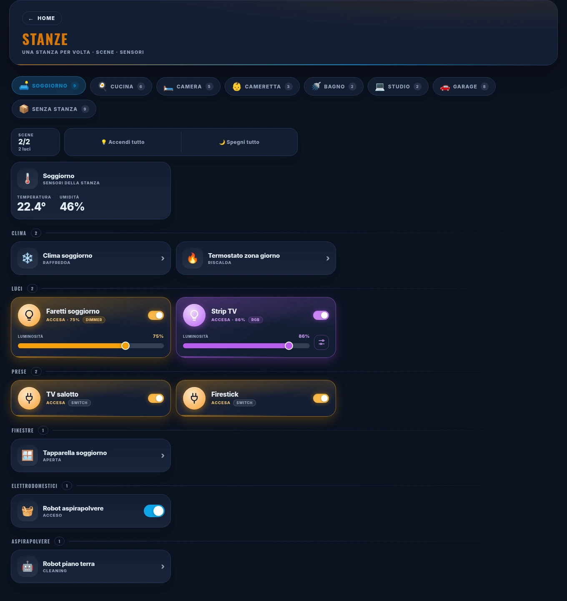 |
| 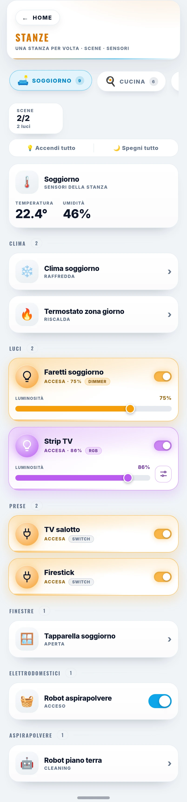 | 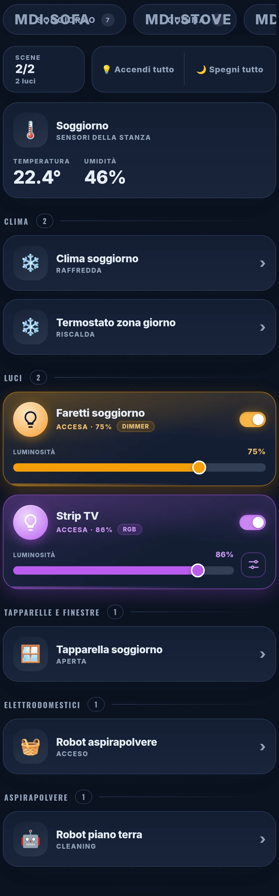 |

Ogni altra sezione legge la casa **per tipo**: tutte le luci insieme, tutte le tapparelle insieme. È il verso giusto quando cerchi una cosa, ed è quello sbagliato quando sei in una stanza. Questa pagina gira il verso.

- Le **pillole delle stanze** in alto, con quante entità ha ciascuna; sotto, tutto quello che quella stanza possiede, **diviso per tipo**: sensori, clima, luci, tapparelle e finestre, elettrodomestici, aspirapolvere, telecamere.
- **Accendi tutto** e **Spegni tutto** in cima, con scritto quante luci toccheranno. «Tutto» qui vuol dire *la luce*: un condizionatore e una tapparella hanno un verso loro, e decidere al posto tuo quale sia «acceso» sarebbe inventare.
- **Le card non sono nuove dove non serve che lo siano**: la luce è la stessa card della pagina Luci, con il suo cursore che funziona.
- Chi non ha una stanza finisce sotto la pillola **Senza stanza**. Non è un errore da nascondere: è la sola occasione di accorgersene.

Non sposta e non riscrive niente: le assegnazioni esistono già, questa pagina le legge dall'altro lato.

> **La stanza si può dire su qualunque entità.** Luci, clima, tapparelle, elettrodomestici, telecamere, carichi, robot e zone d'irrigazione la stanza ce l'hanno perché la loro scheda la chiede. Tutto il resto — una sonda, un sensore di allagamento, la pompa della piscina — la riceve da una **tendina accanto alla riga in cui l'entità è già scritta**, in qualunque scheda si trovi. Dentro ci va l'**id** della stanza e non il suo nome, quindi rinominarla non rompe niente.

---

## Navigazione

| Tema chiaro | Tema scuro |
| --- | --- |
|  |  |
|  |  |

La barra elenca **solo le sezioni che hai configurato**: una sezione senza dati non compare, e si accende da sola appena riceve la prima entità. L'ordine si dispone dall'editor, desktop e mobile possono differire, e ogni sezione si può nascondere a mano — una scelta fatta di persona viene ricordata e non viene più riaccesa dall'automatismo.

---

## Energia

Sei viste, scelte dalle linguette in cima: **Istantanea**, **Giornaliera**, **Mensile**, **Report**, **Analisi**, **Temperature**.

> **Più impianti sotto lo stesso tetto.** Se la casa è l'unione di due appartamenti — due misuratori, due gruppi di carichi — le linguette in cima all'Energia scelgono di quale casa si parla. Ogni impianto ha il suo nome, i suoi misuratori e i suoi carichi, **fino a otto per impianto**, non otto in tutto. Con un impianto solo le linguette non compaiono affatto, e chi ha una casa sola non deve migrare niente.

### Flusso live (Istantanea)

| Tema chiaro | Tema scuro |
| --- | --- |
|  |  |
|  |  |

Diagramma dinamico dei flussi: **Solare, Rete, Batteria e Casa**, più **un cerchio per ogni carico configurato**. Spessore e velocità di ogni connettore seguono la lettura reale del carico: un wallbox a 4 kW disegna una linea più marcata e veloce di un frigo da 80 W. Un carico sotto soglia resta visibile ma spento, uno senza entità mostra `—` invece di uno zero inventato.

Toccando un cerchio si apre il popup con i dispositivi che lo compongono — con un'eccezione: il **cerchio della Wallbox apre direttamente l'auto**, con stato di carica, autonomia e sessione di ricarica, perché il cavo è attaccato a una macchina di cui la plancia sa già tutto.

### Giornaliera e mensile

| Giornaliera | Mensile |
| --- | --- |
|  |  |
|  |  |
|   |   |

Produzione, consumo, prelievo e immissione del giorno e del mese, con costi e risparmio calcolati sulle tariffe che hai impostato, e il confronto con i periodi precedenti.

### Report e analisi

| Report | Analisi |
| --- | --- |
|  |  |
|  |  |
|   | |

Il **Report** mette in fila le voci che hai scelto — apparecchi, carichi, sorgenti — con il consumo del periodo, il costo e la quota sul totale.

L'**Analisi** mostra dove è andata l'energia:

- **Confronto settimanale dei consumi Casa**: settimana corrente contro precedente, sulle statistiche Recorder autenticate e sul bilancio canonico della Casa. I valori dipendono dai tuoi sensori: un riepilogo può riportare **165,1 kWh** senza che quel numero diventi una costante della plancia.
- **Attività dispositivi** del periodo: classifica di elettrodomestici e carichi con quota fotovoltaico e quota rete di ciascuno, più il totale monitorato.
- **Dettaglio dispositivo**: kWh del mese, media giornaliera, picco, risparmio e spesa in euro, totale dell'anno e istogramma giornaliero.

Le icone del Report seguono lo stesso catalogo delle schede: una lavatrice ha lo stesso disegno in Elettrodomestici, in Energia e nei Carichi.

### Temperature d'impianto

| Tema chiaro | Tema scuro |
| --- | --- |
|  |  |
|  |  |

Le sonde dell'impianto — inverter, batteria, quadro — con il loro andamento.

---

## Elettrodomestici

| Tema chiaro | Tema scuro |
| --- | --- |
|  |  |
|  |  |

Ogni apparecchio ha il suo **ritratto disegnato** — lavatrice, lavastoviglie, forno, asciugatrice, frigo e altri venti tipi — che **si anima quando l'apparecchio lavora**. La card dice se è **in funzione**, a che punto è il programma, quanto manca, e quanto è costato l'ultimo ciclo.

Un apparecchio è «in funzione» quando supera la sua **soglia di potenza**, e resta tale per il **ritardo di fine ciclo** che gli hai dato: serve a non far sparire la lavatrice durante una pausa del programma.

### Vista consumi e dettaglio

| Consumi | Dettaglio di un apparecchio |
| --- | --- |
|  |  |
|  |  |
| |   |

Il dettaglio elenca **tutte le entità mappate** su quell'apparecchio con il loro valore: è anche il modo più rapido per capire se un sensore manca o punta al posto sbagliato.

---

## Auto elettrica e wallbox

| Tema chiaro | Tema scuro |
| --- | --- |
|  |  |
|  |  |

Profilo veicolo con **marchio e modello** dal catalogo di **38 marche** — servite dall'integrazione, con i loro colori ufficiali, senza chiamare nessun CDN — oppure la tua foto. Stato di carica, autonomia, odometro, km dall'ultima ricarica, **sessione di ricarica** con quota solare, tensione e temperatura della wallbox, target di carica e **console modalità** (Spento / Solar / Min+Sol / Fast) quando l'integrazione le espone.

Più veicoli convivono, ognuno con il suo profilo e la sua identità: rinominare un'auto non le fa perdere la foto. Le linguette per passare da un'auto all'altra ci sono anche **dentro il popup**. Il **cavo collegato** si può dichiarare con una casella, invece di lasciarlo dedurre dal testo dello stato.

DashboardModern non sostituisce l'integrazione del veicolo o della wallbox: ne presenta le entità.

---

## Luci

| Tema chiaro | Tema scuro |
| --- | --- |
| 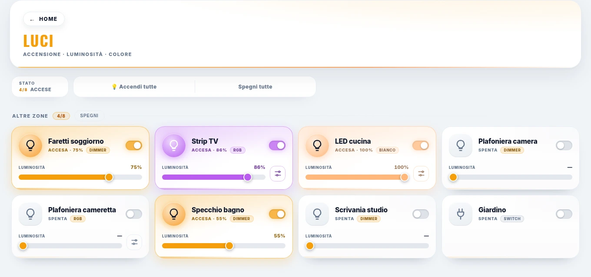 | 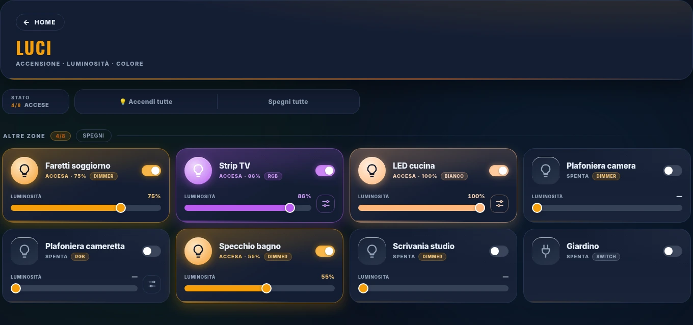 |
| 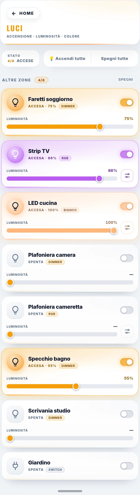 | 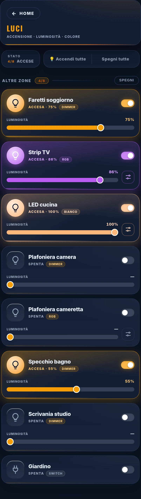 |

Le luci hanno una **sezione propria nella barra**: prima erano solo un popup della Home, che resta comunque raggiungibile dalle azioni rapide.

Ogni luce è una tessera con nome su due righe, stato, e il **cursore della luminosità** direttamente sulla card. Le tessere sono raggruppate per stanza, con il comando di stanza accanto al conteggio che lo riguarda, e da schermo largo crescono fino a riempire la riga — con un tetto, perché una stanza con una luce sola non diventi un cartellone.

### I controlli di una luce

| Tema chiaro | Tema scuro |
| --- | --- |
|  |  |
|  |  |

Luminosità, dodici colori pronti, tinta e saturazione, temperatura di colore. **La plancia offre solo i comandi che l'entità dichiara di accettare**: una luce che non ha il colore non mostra la ruota, una che è di fatto un interruttore mostra solo acceso e spento.

Restano raggiungibili dalle azioni rapide anche i due popup della Home: **gestione luci** e **controllo rapido del clima**.

| Gestione luci | Controllo rapido clima |
| --- | --- |
|  |  |
|  |  |
|   |   |

---

## Clima

| Tema chiaro | Tema scuro |
| --- | --- |
|  |  |
|  |  |

Le unità si dividono in **Freddo** e **Caldo**, e la pagina mostra **solo le famiglie che la casa ha davvero**: con soli condizionatori la scheda «Caldo» non compare, e quando ne resta una l'interruttore sparisce perché non c'è niente fra cui scegliere.

Una **pompa di calore** che fa entrambe le cose si dichiara come tale e compare in tutte e due. Il tasto di accensione accende davvero, e un condizionatore acceso dalla scheda Freddo parte a raffrescare, non a scaldare.

---

## Temperatura e umidità

| Tema chiaro | Tema scuro |
| --- | --- |
|  |  |
|  |  |

Una card per stanza con temperatura, umidità e un **giudizio di comfort** — freddo, comfort, caldo — con la barra colorata che dice dove sta il valore. Le pillole in alto filtrano per stanza, e il grafico in fondo confronta **tutte le stanze** sulle 24 ore o sui 7 giorni, con la fascia di comfort disegnata dietro.

---

## Tapparelle, tende e finestre

| Tema chiaro | Tema scuro |
| --- | --- |
|  |  |
|  |  |

Ogni scheda è una **finestra guardata dalla stanza**, che è da dove si guarda una tapparella davvero. In primo piano l'**infisso**: telaio, due ante con il vetro, maniglia. Dietro il vetro **scende la tapparella**, disegnata a stecche. Dietro ancora c'è il fuori: cielo con sole e nuvole di giorno, luna e stelle di notte, che **segue l'ora reale**.

- **Il cursore si trascina in verticale** come la tapparella vera, e al rilascio la porta a quella posizione. La percentuale dei preset si sceglie, non è più fissa.
- **La finestra si apre.** Con un **sensore di apertura dell'infisso** collegato, quando il contatto dice aperto le ante rientrano verso i cardini e accanto allo stato compare **«Finestra aperta»**. Senza sensore la scheda resta com'era: non viene disegnata un'apertura che nessuno ha misurato.
- **Anche solo il sensore basta.** Chi ha persiane manuali e nessun motore può inserire il solo contatto: ne esce una card che disegna lo stesso serramento, con le ante che si scostano, e sotto nessun comando — perché su una persiana manuale Apri/Ferma/Chiudi non arriverebbe da nessuna parte. Nel conteggio in cima quelle finestre hanno una voce loro.
- **Tende e tapparelle su due relè** sono supportate: una copertura comandata da due interruttori separati, e le tende da sole con il loro verso.
- Una finestra con più coperture resta **una sola card**, non tre.

---

## Sicurezza, telecamere e aperture

| Tema chiaro | Tema scuro |
| --- | --- |
|  |  |
|  |  |

**L'antifurto mostra i tasti che la tua centrale ha davvero.** Non tre tasti fissi uguali per tutti: i comandi si costruiscono da quello che l'entità dichiara di supportare, e ogni stato accende il suo. Il **tastierino compare solo se un codice esiste**, e serve anche per inserire quando la centrale lo richiede — dove non serve, non si preme OK a vuoto.

**Le telecamere** si vedono dal vivo, con lo scatto aggiornato e l'apertura a pieno schermo. Compaiono anche in miniatura nel Colpo d'occhio della Home.

**Le aperture**: portoni, serrature e cancelli, con il comando di apertura e — dove serve — il **PIN** prima di aprire.

| Dettaglio avvisi |
| --- |
|   |

Porte, finestre, allagamenti, fumo e batterie scariche vivono nei **gruppi di avvisi**, che compaiono come tessere in Home. Ogni avviso si muove come quello che significa: la porta si apre sul cardine, la batteria cala di livello, l'antifurto pulsa.

---

## Solare termico

| Tema chiaro | Tema scuro |
| --- | --- |
|  |  |
|  |  |

L'impianto disegnato in vista isometrica: pannelli, circuito, accumulo e valvole. Ogni sonda dice **cosa misura**, e la pompa si anima quando circola davvero.

---

## Piscina

| Tema chiaro | Tema scuro |
| --- | --- |
|  |  |
|  |  |

La vasca disegnata con l'acqua che si muove, temperatura, **pH e cloro** con le loro soglie, filtrazione, riscaldamento e luce. Fuori soglia il valore si colora, invece di restare un numero come gli altri.

---

## Irrigazione

| Tema chiaro | Tema scuro |
| --- | --- |
|  |  |
|  |  |

Le zone con la loro valvola, i minuti di ciascuna, l'orario di partenza e il **blocco pioggia**: sopra la probabilità che hai impostato, il ciclo non parte.

**L'irrigazione guarda il terreno.** Con un sensore di **umidità del suolo** collegato, la zona mostra quanto è bagnata e le sue soglie: si evita di innaffiare un terreno già umido.

---

## Aspirapolvere

| Tema chiaro | Tema scuro |
| --- | --- |
| 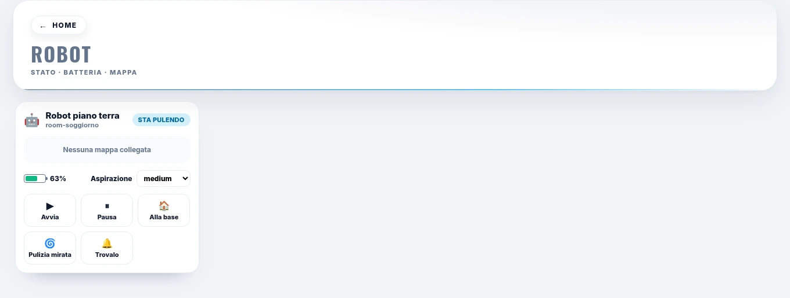 | 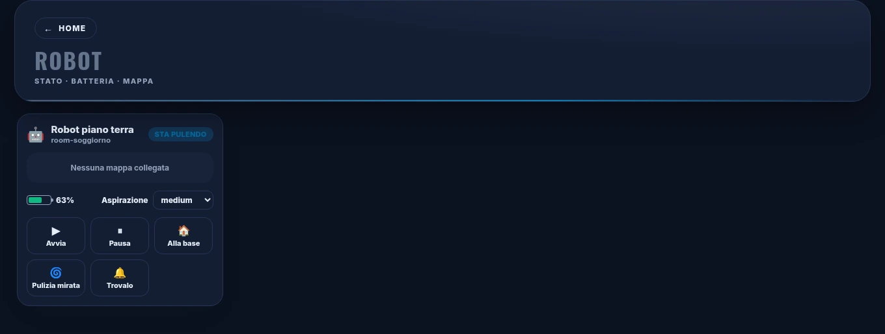 |
| 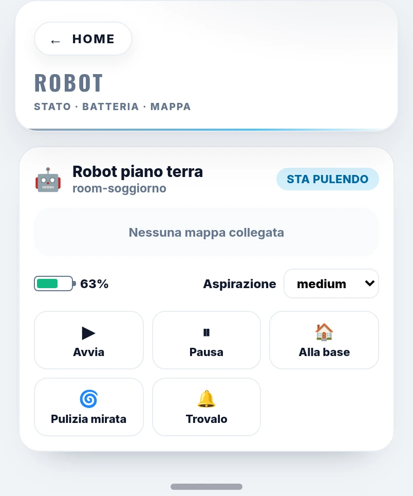 | 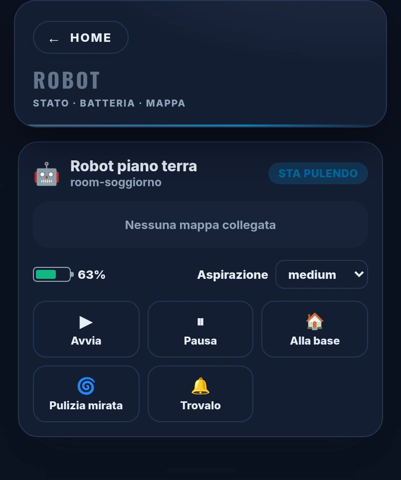 |

I robot di casa con stato, batteria, potenza di aspirazione e i comandi — avvio, pausa, rientro alla base. Ogni robot ha la sua stanza, scelta da una tendina, e la mappa quando l'integrazione la espone.

---

## MiniPC e rete

| Tema chiaro | Tema scuro |
| --- | --- |
|  |  |
|  |  |

La macchina disegnata in 3D con **CPU, RAM e disco** come barre che crescono, il **termometro della CPU** con giudizio e limite, la telemetria (consumo, uptime, Speedtest download e upload), il **carico CPU live** e la riga di rete con connettività e stato dell'inverter.

---
# Editor Dashboard: tutte le configurazioni

L'editor è un'unica finestra con **ventidue schede**, una per area. Tutte le configurazioni descritte qui sono **visuali**: nessun YAML.

`Impostazioni` · `Home` · `Energia` · `EV` · `Solare` · `Sicurezza` · `MiniPC` · `Temperatura` · `Azioni` · `Clima` · `Piscina` · `Irrigazione` · `Tapparelle` · `Stanze` · `Luci` · `Elettrodom.` · `Aperture` · `Backup` · `Widget` · `Aspirapolvere` · `Persone` · `Runtime`

> Le schermate qui sotto sono in **tema chiaro**; l'editor segue il tema della plancia, quindi in tema scuro le stesse schede appaiono scure — c'è una galleria in fondo al capitolo.


### ⚙️ Impostazioni

| Blocco | Cosa contiene |
| --- | --- |
| **Generali** | nome della plancia e utente amministratore |
| **Auto elettriche** | profili veicolo salvati, con marchio, modello e foto |
| **Ordine navbar** | disponi le sezioni della barra come preferisci |
| **Autorilevamento** | proposta automatica delle entità da collegare → [capitolo dedicato](#autorilevamento-entità) |
| **Diagnosi navbar** | stato di visibilità di ogni sezione, utile per capire perché una scheda non appare |
| **Reset totale** | azzera la configurazione della plancia |

La visibilità di ogni sezione si accende e si spegne dal pulsante verde in testa alla scheda corrispondente, e una sezione si accende da sola appena riceve dati configurati.

<a id="autorilevamento-entità"></a>

### 🪄 Autorilevamento entità

| Tema chiaro | Tema scuro |
| --- | --- |
|  |  |

Un pulsante legge tutte le entità di Home Assistant e **propone** collegamenti, luci, stanze, unità clima, telecamere e gruppi di avvisi.

1. Premi **🪄 Avvia autorilevamento**. Una barra mostra le fasi: lettura delle entità, lettura dei registri (piani, aree, dispositivi), analisi.
2. Le entità vengono indicizzate **una volta sola** e messe in liste di ricerca per parola: ogni slot guarda solo le entità che condividono un termine con lui, quindi l'analisi finisce in millisecondi anche con migliaia di entità e **la pagina non si blocca**.
3. Ogni etichetta viene letta come una richiesta precisa: l'**unità di misura** fra parentesi (`kWh`, `W`, `%`, `°C`, `bar`, `Mbit/s`…), la **device class** che quell'unità implica, il **dominio** suggerito da una parola iniziale (`Script…`, `Interruttore…`, `Valvola…`, `Meteo…`) e il **periodo** (`oggi`, `mese`, `anno`).
4. Tutte le coppie *(slot, entità)* vengono valutate insieme e assegnate **in ordine di confidenza**: vince la corrispondenza più forte, non quella che capita prima nell'elenco.

Al termine compare il riepilogo **🪄 Ecco cosa ho trovato**, con quante entità sono state analizzate e in quanti millisecondi, e le righe: 🔗 collegamenti, 💡 luci, 🌡️ stanze, ❄️ unità clima, 📹 telecamere, 🔔 entità nei gruppi avvisi. Le categorie **già configurate** non vengono toccate, e i campi con due candidati ugualmente plausibili **non vengono indovinati**.

> **Niente è stato ancora salvato.** La configurazione cambia solo quando premi **✅ APPLICA E RICARICA**. I valori vengono scritti **senza mai sovrascrivere** quello che hai già impostato, e gli slot di **Energia** passano dal modello canonico, che è ciò che li rende persistenti.

### 🚪 Stanze


Le stanze sono il **registro condiviso**: nome, **icona dal catalogo visuale**, piano e ordine. Rinominare una stanza o spostarla di piano aggiorna insieme Temperatura, Clima, Luci, Tapparelle, Elettrodomestici e la pagina Stanze, perché tutte le sezioni referenziano l'`id` della stanza, non il suo nome.

### 👥 Persone

| Tema chiaro | Tema scuro |
| --- | --- |
| 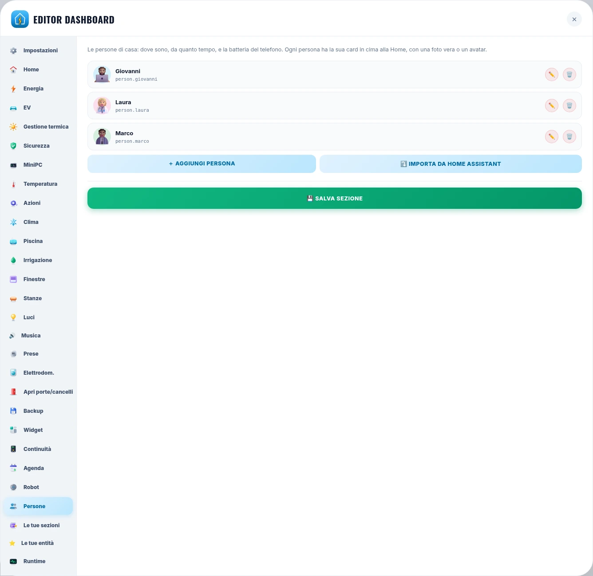 | 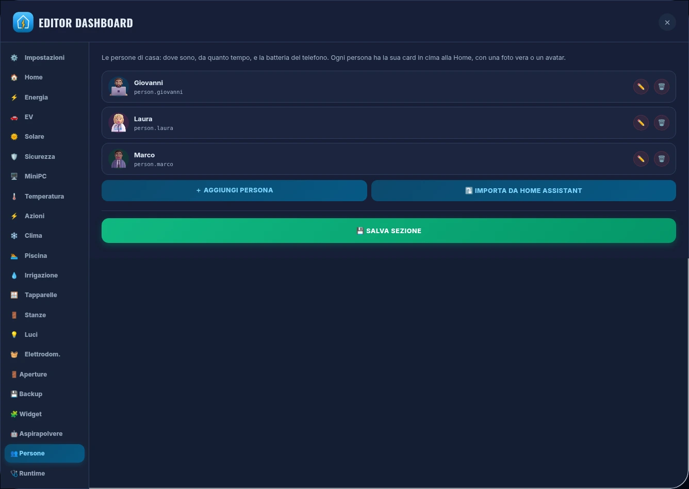 |

Ogni persona ha un'entità (`person.*`, o `device_tracker.*` per chi non ha creato le persone in Home Assistant), un nome e un ritratto. Il pulsante **importa** propone ogni `person.*` che la plancia non conosce ancora, col suo nome e la sua foto.

**Il ritratto è un personaggio 3D**, e i pezzi si combinano liberamente:

| Scelta | Opzioni |
| --- | --- |
| **Persona** | uomo, donna, neutro, ragazzo, ragazza, anziano |
| **Capelli** | lisci, barba, ricci, rossi, bianchi, calvo |
| **Carnagione** | cinque tonalità |
| **Vestito** | ventinove: ufficio, medico, cuoco, smoking, velo, pompiere, poliziotto, muratore, operaio, meccanico, contadino, pilota, astronauta, giudice, supereroe, scienziato, insegnante, studente, informatico, artista, cantante, guardia, detective, turbante, supercattivo, mago, fata, vampiro, elfo |

Sono **oltre tremila combinazioni**, e sono libere davvero: «ricci» e «cuoco» insieme si possono, perché la testa scelta viene riscalata e incollata sul busto scelto. Nel costruttore ogni pastiglia è **il tuo ritratto con quel pezzo addosso**, non un'icona generica; e c'è il 🎲 per il caso.

I ritratti sono i render 3D di **Fluent Emoji** (Microsoft, licenza MIT), **vendorizzati nell'integrazione**: 396 immagini, 3,2 MB, nessuna rete a runtime. Chi preferisce può mettere una **foto vera**, che vince sul ritratto.

> **Respirano e sbattono le ciglia.** Il respiro è CSS. Il battito lo disegna la plancia sopra gli occhi trovati in fase di build, prendendo il colore dalla guancia della persona stessa così che combaci con qualunque carnagione: dura trecento millisecondi, poi la tela torna ferma — una plancia con quattro persone non disegna niente. L'espressione la decide quello che la plancia già sa: chi è a casa ha gli occhi che ridono, chi ha la batteria agli sgoccioli ha le palpebre pesanti.

**I sensori del telefono si trovano da soli**: batteria, stato di carica, indirizzo, attività, WiFi, orologio, distanza, tempo di rientro e direzione.

### ⚡ Energia

Quattro pannelli interni: **Flussi ed entità**, **Carichi**, **Report**, **Impostazioni**. In cima, le linguette degli **impianti**.


**Flussi ed entità** — per ognuna delle sorgenti (**Casa**, **Rete prelevata**, **Rete immessa**, **Fotovoltaico**, **Batteria carica**, **Batteria scarica**):

| Campo | Ruolo |
| --- | --- |
| **Potenza istantanea** (W) | valore live per il flusso |
| **Energia giornaliera / mensile / annuale** (kWh) | override facoltativi |
| **Contatore energia totale** (kWh) | il sensore **cumulativo** (`state_class: total` o `total_increasing`): è la sorgente di report, mesi precedenti e grafici |
| **Stato di carica** (%) | solo batteria |

<table>
<tr>
<td width="33%"></td>
<td width="33%"></td>
<td width="33%"></td>
</tr>
</table>

**Carichi** — una card per ogni cerchio sotto Casa: nome, **icona**, **colore**, potenza istantanea, contatore totale, sensori di periodo, riordino, eliminazione e i **dispositivi contenuti**, che finiscono nel popup del cerchio. Un carico con dispositivi assegnati vale la **somma** dei suoi dispositivi; un carico con un sensore proprio usa quello, che è più preciso. **Fino a otto carichi per impianto.**

**Report** — quali voci compaiono nel Report e nell'Analisi: etichetta, icona, **entità totale per lo storico** e visibilità.

**Impostazioni** — **costo €/kWh** e **prezzo di immissione**, più le viste Energia da mostrare.

> **Più impianti.** Ogni impianto ha nome, misuratori e carichi propri. L'**id** nasce una volta e non si ricava mai dal nome: rinominare «Casa Giovanni» non sposta niente. Cancellarne uno porta via i suoi carichi, che altrimenti resterebbero orfani e invisibili.

### 🌡️ Temperatura


Temperatura e umidità per stanza, con le soglie di comfort.

### 🧺 Elettrodomestici


Per ogni apparecchio: **tipo** dal catalogo (venti tipi, ognuno col suo ritratto animato), stanza, entità di controllo, potenza, energia giornaliera e totale, stato del programma, tempo rimanente, temperatura, ultimo ciclo (durata, energia, costo), **soglie di standby e funzionamento** e **ritardo di fine ciclo**.

### 💡 Luci · ❄️ Clima · 🪟 Tapparelle

<table>
<tr>
<td width="33%"></td>
<td width="33%"></td>
<td width="33%"></td>
</tr>
</table>

- **Luci**: entità (`light.`, `switch.`, `input_boolean.`, `fan.`, `group.`), nome, stanza — chiesta subito quando aggiungi una luce — e ordine.
- **Clima**: entità `climate.*`, stanza e assegnazione a **Freddo**, **Caldo** o entrambi per una pompa di calore.
- **Tapparelle**: entità `cover.*` (anche **due relè separati**), nome, stanza, **sensore apertura infisso** e percentuali dei preset. Il solo sensore basta per una persiana manuale.

### 🤖 Aspirapolvere · ✅ Cose da fare · 🚪 Aperture

<table>
<tr>
<td width="33%">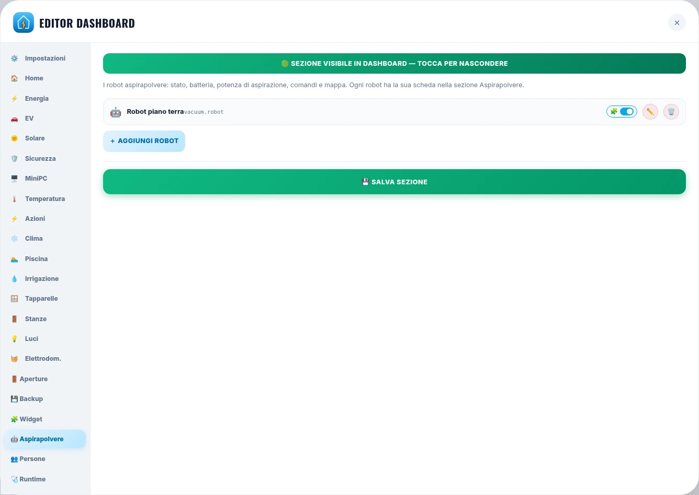</td>
<td width="33%">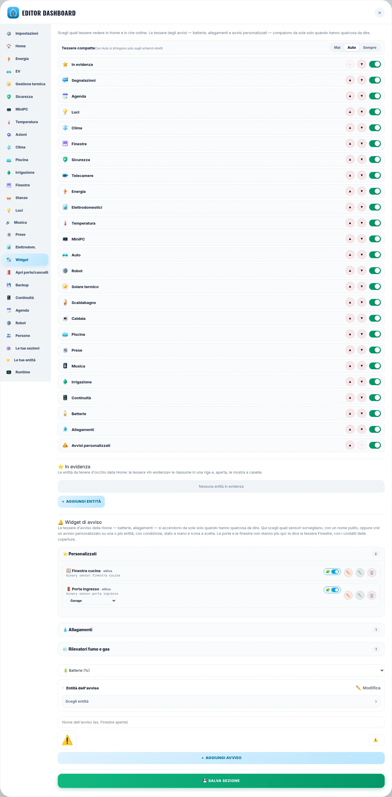</td>
<td width="33%">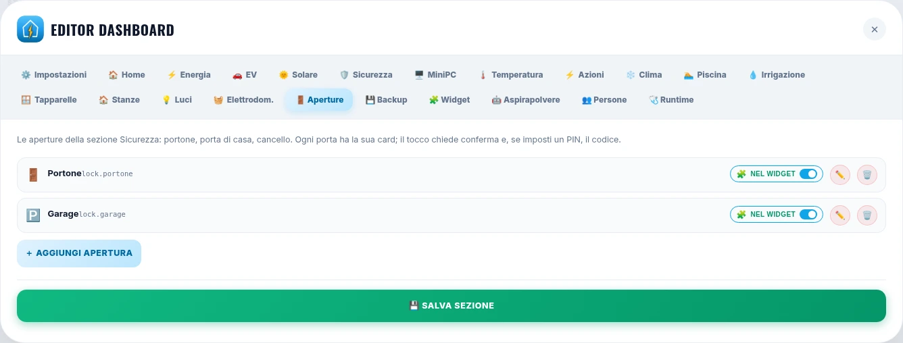</td>
</tr>
</table>

- **Aspirapolvere**: entità `vacuum.*`, nome, stanza dalla tendina, entità mappa.
- **Cose da fare**: le liste `todo.*` di Home Assistant che vuoi vedere in Home, con il conteggio di cosa resta da spuntare.
- **Aperture**: portoni, serrature e cancelli con nome, icona e **PIN** facoltativo prima di aprire.

### 🧩 Widget · ⚡ Azioni rapide

<table>
<tr>
<td width="50%"></td>
<td width="50%"></td>
</tr>
</table>

- **Widget** decide cosa compare nel Colpo d'occhio: quali tessere, in che ordine, e i **gruppi di avvisi** con la loro icona e animazione. La scelta si fa anche entità per entità, con l'interruttore accanto a ogni campo, che dice se quell'entità è dentro la tessera o ne sta fuori.
- **Azioni rapide**: i comandi della Home — sezioni predefinite, script, interruttori — con nome e icona.

### 🏊 Piscina · 💧 Irrigazione · 🚗 EV

<table>
<tr>
<td width="33%"></td>
<td width="33%"></td>
<td width="33%"></td>
</tr>
</table>

- **Piscina**: temperatura, pH, cloro con le soglie, pompa, riscaldamento, luce.
- **Irrigazione**: zone con valvola, minuti, stanza, orario, **umidità del terreno** con le sue soglie, blocco pioggia e meteo.
- **EV**: profili veicolo con marca e modello dal catalogo, foto normale e col cavo, entità della vettura e della wallbox, **cavo collegato**, target di carica e console modalità.

### 💾 Backup e ripristino

| Tema chiaro | Tema scuro |
| --- | --- |
| 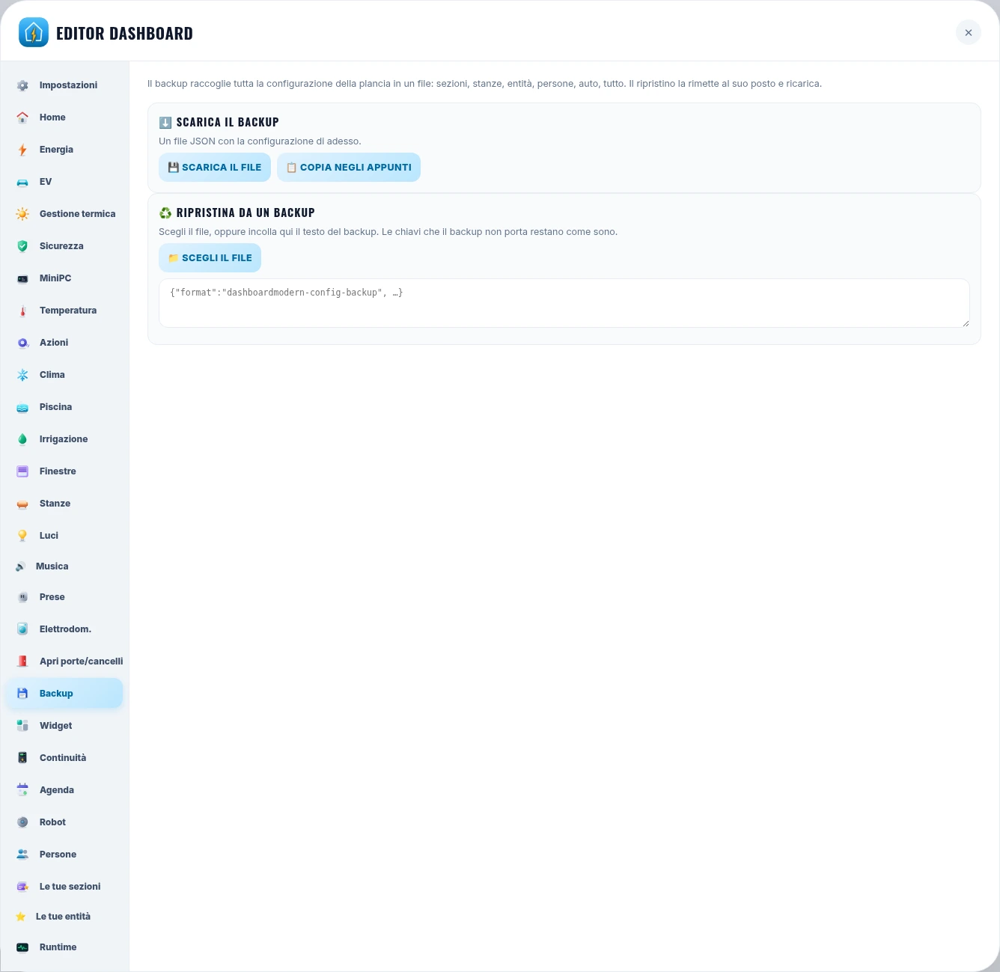 | 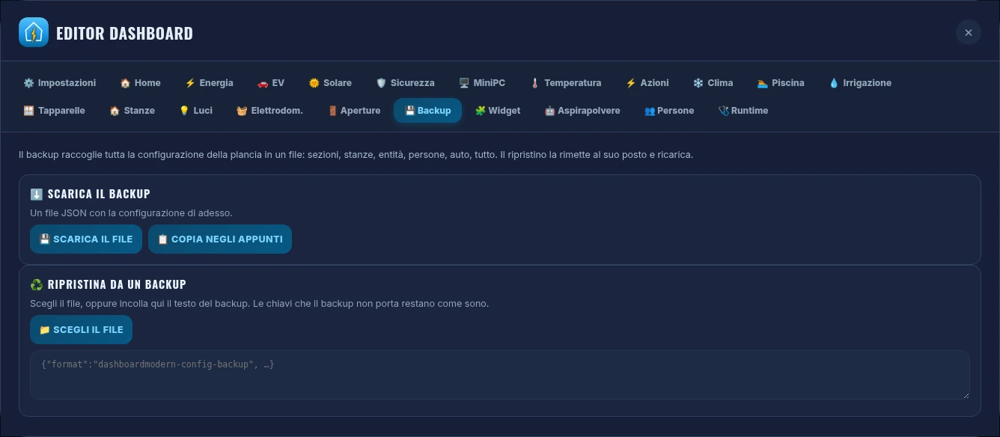 |

Scarica l'intera configurazione come file e la rimette da un file. Serve per spostare una plancia su un'altra installazione, per tenersi una copia prima di una modifica grossa, o per tornare indietro dopo un ripensamento.

### 🩺 Runtime

L'ultima scheda è di diagnostica: versione della plancia, stato del bridge di autenticazione, ultimo salvataggio sincronizzato, istanza (utile con più plance) e stato di visibilità delle sezioni. È la prima cosa da guardare quando qualcosa non compare.

### L'editor in tema scuro

<details>
<summary><strong>Apri la galleria dell'editor in tema scuro</strong></summary>

<table>
<tr><td width="33%"><br><sub>Impostazioni</sub></td><td width="33%"><br><sub>Stanze</sub></td><td width="33%"><br><sub>Persone</sub></td></tr>
<tr><td width="33%"><br><sub>Energia · flussi</sub></td><td width="33%"><br><sub>Energia · carichi</sub></td><td width="33%"><br><sub>Energia · report</sub></td></tr>
<tr><td width="33%"><br><sub>Energia · tariffe</sub></td><td width="33%"><br><sub>Elettrodomestici</sub></td><td width="33%"><br><sub>Temperatura</sub></td></tr>
<tr><td width="33%"><br><sub>Luci</sub></td><td width="33%"><br><sub>Clima</sub></td><td width="33%"><br><sub>Tapparelle</sub></td></tr>
<tr><td width="33%">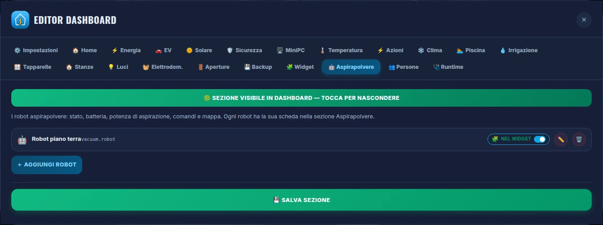<br><sub>Aspirapolvere</sub></td><td width="33%">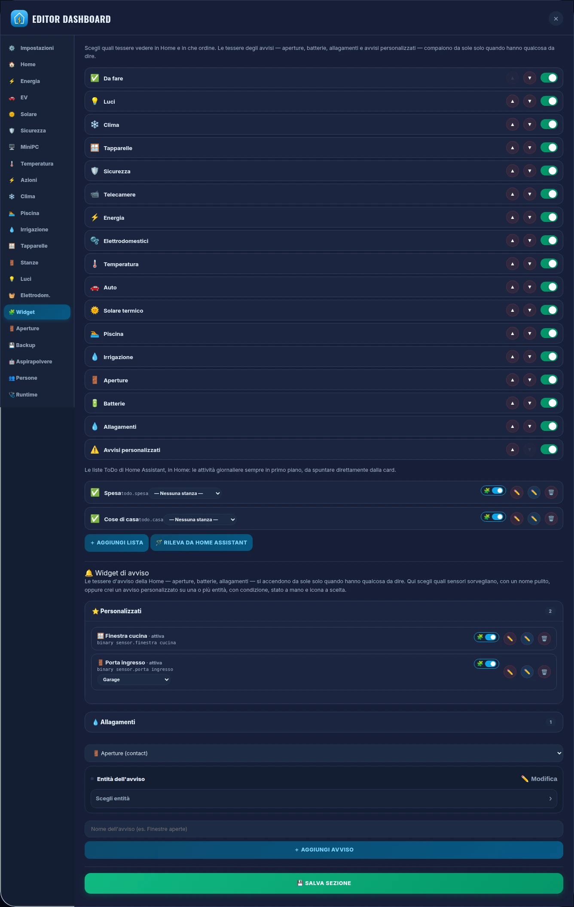<br><sub>Cose da fare</sub></td><td width="33%">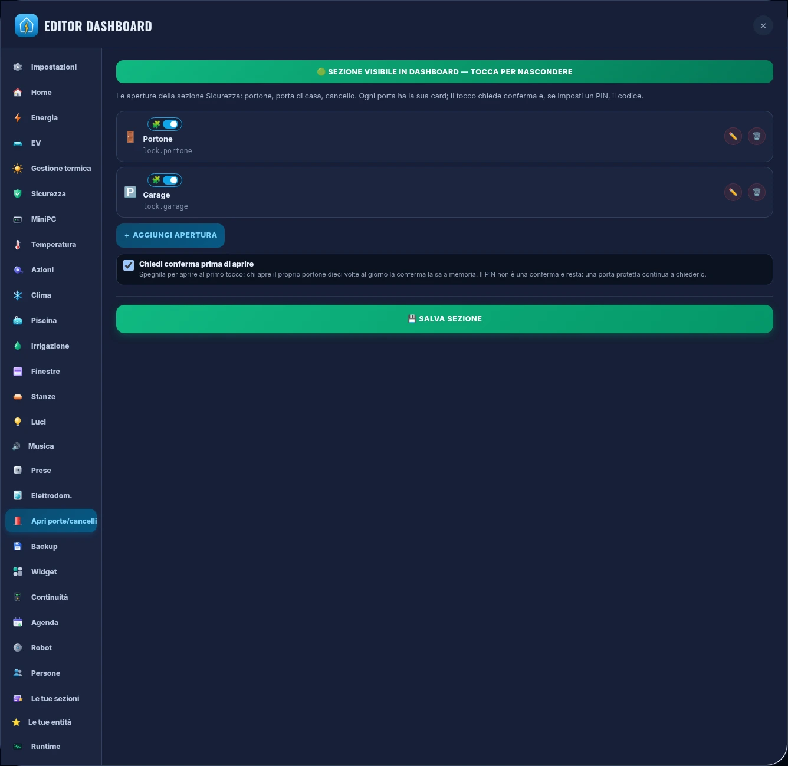<br><sub>Aperture</sub></td></tr>
<tr><td width="33%"><br><sub>Piscina</sub></td><td width="33%"><br><sub>Irrigazione</sub></td><td width="33%"><br><sub>Auto elettrica</sub></td></tr>
<tr><td width="33%"><br><sub>Widget e avvisi</sub></td><td width="33%"><br><sub>Azioni rapide</sub></td><td width="33%"><br><sub>Backup</sub></td></tr>
</table>

</details>

---
# Come vengono calcolati i numeri

### Consumo Casa

Quando i flussi necessari sono completi, DashboardModern usa lo **stesso bilancio della distribuzione Energia di Home Assistant**:

```text
Casa = Fotovoltaico + Rete prelevata + Batteria scaricata
       − Rete immessa − Batteria caricata
```

Se il confine dei flussi non è completo, il sensore Casa configurato viene usato come **fallback**.

### Periodi e storico

| Cosa | Da dove viene |
| --- | --- |
| Valore live | stato corrente dell'entità di potenza |
| Giorno / mese / anno correnti | i sensori di periodo configurati, se ci sono; altrimenti il delta del contatore totale |
| Mesi e anni precedenti | **solo** dalle statistiche Recorder del contatore cumulativo |
| Grafici | un bucket per intervallo, come differenza fra due `sum` Recorder adiacenti |

La formula è `sum(fine periodo) − sum(inizio periodo)` su `recorder/statistics_during_period`, quindi i **reset del contatore fisico** e le normalizzazioni di unità già applicate da Recorder vengono rispettati. Un contatore lifetime **non viene sommato** al consumo del giorno.

**In pratica**: per navigare lo storico serve un **contatore totale kWh** con `device_class: energy` e `state_class: total` o `total_increasing`. Un sensore "mensile" non lo sostituisce.

Dettagli e test di parità: [`docs/ENERGY_RECORDER_PARITY.md`](docs/ENERGY_RECORDER_PARITY.md).

### Più impianti

Ogni impianto fa il proprio bilancio con i propri misuratori: le linguette in cima all'Energia non filtrano una vista, cambiano la casa di cui si parla. Rete, Solare e Casa seguono l'impianto scelto, e i carichi sono i suoi.

### Somma di un carico

Un carico del flusso vale la **somma dei dispositivi assegnati**, con gli stessi delta Recorder usati altrove: aggiungere un elettrodomestico a un carico fa crescere il cerchio senza altro da configurare. Se il carico ha un sensore proprio, quello vince, perché misura anche ciò che nessuna presa vede.

### Costi, risparmio e CO₂

Costo €/kWh e prezzo di immissione si impostano in `Editor → Energia → Impostazioni`; un elettrodomestico può avere una **tariffa propria**. Da lì derivano pagato, costo reale, risparmio grazie al fotovoltaico, venduto e la stima di CO₂ evitata.

### Stato "In funzione"

Un apparecchio è in funzione quando l'**entità di stato programma** lo dice; in assenza di quella, quando la potenza supera la **soglia in funzione**. Fra soglia standby e soglia in funzione l'apparecchio è in **Standby**: una presa alimentata non viene confusa con un ciclo in corso.

### Letture assenti

Un'entità mancante, `unavailable`, `unknown` o non mappata non diventa zero: mostra `—`. È una scelta di progetto, così un grafico non racconta un consumo che non c'è.

---
# Potenzialità

### Due modi di guardare la stessa casa

Per tipo — tutte le luci, tutte le tapparelle — quando cerchi una cosa. **Per stanza** quando sei in una stanza. Le assegnazioni sono le stesse, lette dai due lati: non c'è niente da configurare due volte.

### Una plancia che si adatta alla casa, non il contrario

Nessuna sezione è obbligatoria e nessuna va nascosta a mano: una sezione appare quando riceve dati e sparisce quando non ne ha. Chi non ha la piscina non vede la piscina. E la plancia mostra **solo i comandi che l'entità dichiara di accettare**: i tasti dell'antifurto sono quelli della tua centrale, i comandi di una luce sono quelli che quella luce ha davvero.

### Una configurazione, tutta la casa

Vive dentro Home Assistant, uguale su ogni dispositivo e per ogni utente, con storia delle revisioni, difesa contro gli svuotamenti accidentali e **backup su file**. Le preferenze che hanno senso solo su un dispositivo — tema, barra, kiosk — restano lì.

### Energia come strumento di analisi

Non solo un numero grande: bilancio con la stessa aritmetica di Home Assistant, storico dalle statistiche Recorder, **confronto settimanale** e **classifica dei dispositivi** con quota fotovoltaico e quota rete, costi e risparmio reali, carichi che si sommano da soli. E **più impianti**, per chi ha più di un contatore sotto lo stesso tetto.

### Dispositivi trattati per quello che sono

Un elettrodomestico ha un ciclo, non uno stato acceso/spento: soglie, ritardo di fine ciclo, ultimo consumo, costo. Un'auto ha un'identità che sopravvive al rinominarla. Una tapparella sta fuori e la finestra sta dentro. Un robot ha una stanza.

### Scene, non pannelli

Piscina, solare termico, MiniPC, tapparelle e flusso energia sono **disegni che si muovono con i dati**: la pompa gira quando circola, la tapparella scorre alla sua posizione, il cielo dietro la finestra segue l'ora, l'acqua della vasca ondeggia. Le persone respirano e sbattono le ciglia.

### Comodità quotidiane

Colpo d'occhio con le tessere di ogni sezione, telecamere in miniatura dal vivo, azioni rapide, liste delle cose da fare, avvisi che si muovono come quello che significano, kiosk su iPhone e iPad, tema chiaro e scuro.

### Robustezza

Nessuna dipendenza da internet a runtime: marchi delle auto, ritratti e icone sono dentro l'integrazione. Le animazioni si muovono su `transform` e `opacity`, quelle che il compositore porta da solo. Rientrare nell'app non lascia la plancia a metà. Una lettura assente resta `—` e non diventa zero.

---

## Architettura in breve

| Strato | Ruolo |
| --- | --- |
| **Integrazione Python** | config entry, pannello, percorso statico versionato, archivio condiviso, comandi WebSocket |
| **Archivio condiviso** | `.storage/dashboardmodern.config` con revisioni, difese e migrazioni di schema |
| **Frontend vendorizzato** | il documento della plancia servito da Home Assistant |
| **Moduli `src/core`** | logica pura e testabile: modelli, calcoli energia, catalogo icone, ritratti, autorilevamento |
| **Moduli `src/sections`** | ogni sezione della plancia e ogni scheda dell'editor, con un proprietario solo per pixel |

Il principio che tiene insieme il codice è **un proprietario per cosa disegnata**: due moduli che scrivono lo stesso pixel sono la causa più frequente di sfarfallii e valori che tornano indietro, e nel progetto sono trattati come difetti.

### Struttura della repository

```text
custom_components/dashboardmodern/
├── __init__.py, config_flow.py, frontend.py, websocket_api.py, config_store.py
├── manifest.json
└── frontend/
    ├── legacy/          il documento della plancia (IT ed EN)
    ├── src/core/        logica pura, testabile senza browser
    ├── src/sections/    sezioni della plancia e schede dell'editor
    ├── avatars/         i ritratti 3D (Fluent Emoji, MIT)
    ├── brands/          i 38 marchi delle auto
    ├── tests/           test unitari Node
    └── e2e/             test Playwright (desktop, mobile, webkit-iPad)
docs/preview/            le immagini di questo README
scripts/                 build, vendoring, generazione anteprime
```

---

## Sviluppo, test e anteprime

### Frontend

```bash
npm ci
npm run test:frontend        # test unitari
npm run check:inline-syntax  # gli script inline del documento compilano
npm run format:check         # Prettier
```

### Test browser

```bash
npx playwright test                      # tutti i progetti
npx playwright test --project=desktop    # solo desktop
npx playwright test --project=mobile
npx playwright test --project=webkit-ipad
```

### Test Python

```bash
python -m pip install -r requirements_test.txt
python -m pytest -q
ruff check . && ruff format --check .
```

### Rigenerare le anteprime del README

Le immagini in `docs/preview/` sono generate dalla casa demo di `scripts/preview-fixture.mjs` con un Home Assistant simulato (stati, storico, statistiche Recorder, archivio condiviso e fallback REST):

```bash
npm ci
npm i --no-save chart.js@4.5.1 simple-icons@16.27.1   # facoltativo: grafici e loghi reali

# galleria tema scuro/auto  → docs/preview/<sezione>.webp
node scripts/capture-previews.mjs

# galleria tema chiaro      → docs/preview/<sezione>-light.webp
node scripts/capture-previews.mjs --theme light --keep

# solo alcune sezioni, o la versione inglese
node scripts/capture-previews.mjs --only home,rooms,lights
node scripts/capture-previews.mjs --variant dashboard-en.html --out docs/preview-en
```

Opzioni utili: `--format png`, `--quality 0.95`, `--all-mobile`, `--debug`, `--headed`, `--port`, `--fresh`.

> La passata completa senza `--theme` svuota `docs/preview/` prima di ricominciare; una passata parziale (`--theme`, `--only`) non lo fa mai, per non portarsi via la galleria dell'altro tema. Per svuotare davvero anche in quel caso serve `--fresh`.

Lo script avvia un server statico sulla cartella `frontend`, apre il documento della plancia in Chromium contro il finto Home Assistant, attraversa ogni sezione e ogni scheda dell'editor, adatta il viewport al contenuto e salva l'immagine. Le sezioni la cui resa dipende dal movimento vengono catturate con le animazioni attive; le altre a scena ferma.

### Pubblicare una nuova versione

Il workflow `Release` pubblica da solo quando `main` riceve una modifica a `manifest.json` o un tag `v*`, e marca come pre-release solo i tag che contengono un trattino.

---

## Risoluzione problemi

Prima di aprire una Issue verifica:

1. la versione realmente installata in HACS;
2. che non sia presente **In attesa di riavvio**;
3. di aver riavviato Home Assistant dopo l'aggiornamento;
4. di aver chiuso e riaperto l'app Companion o ricaricato del tutto il browser;
5. che le entità configurate esistano ancora, e che gli slot puntino ai nuovi `entity_id` se li hai rinominati;
6. per Energia, che i sensori abbiano **statistiche Recorder** utilizzabili;
7. il **Registro** di Home Assistant;
8. la scheda **Runtime** dell'editor, che riassume versione, bridge, sincronizzazione e stato delle sezioni.

| Sintomo | Prima cosa da guardare |
| --- | --- |
| Una sezione non compare nella barra | la sezione è visibile? (`Editor → Impostazioni → Diagnosi navbar`) |
| Una card mostra `—` | lo slot corrispondente non è mappato, oppure l'entità è `unavailable`/`unknown` |
| Report e mesi precedenti vuoti | manca il **contatore energia totale** cumulativo, o Recorder non ha statistiche per quel sensore |
| Consumo Casa incoerente | il confine dei flussi non è completo: manca uno fra fotovoltaico, rete prelevata/immessa, batteria carica/scarica |
| I numeri dell'Energia sono di un'altra casa | è selezionato un altro **impianto**: guarda le linguette in cima |
| Un apparecchio risulta sempre acceso | soglia **In funzione** troppo bassa, oppure manca l'entità di stato programma |
| Un'entità non compare nella pagina Stanze | non ha una stanza: assegnala dalla tendina accanto alla riga, in qualunque scheda si trovi |
| Una persona non mostra la batteria | il sensore del telefono non è collegato: `Editor → Persone`, oppure premi **rileva dal telefono** |
| Un tasto dell'antifurto manca | la tua centrale non dichiara quella modalità: la plancia mostra solo quelle supportate |
| La plancia sembra vuota su un dispositivo | la configurazione è nell'archivio condiviso: ricarica la pagina e controlla la scheda **Runtime** |
| Su iPhone la plancia copre Home Assistant | è la modalità kiosk: tieni premuto l'hamburger per spegnerla, o apri con `?kiosk=0` |

Quando apri una Issue indica: versione DashboardModern, versione Home Assistant, dispositivo e browser/app, lingua della plancia, se il problema è su mobile/tablet/desktop, i passaggi per riprodurlo e uno screenshot se utile.

👉 **Issues:** https://github.com/danigio15/dashboardmodern-v2/issues

---

## Documentazione del progetto

- [`CHANGELOG.md`](CHANGELOG.md) — cosa cambia a ogni versione
- [`docs/CHANGELOG_PRE_1.0.md`](docs/CHANGELOG_PRE_1.0.md) — archivio delle versioni precedenti alla 1.0
- [`docs/RELEASE_1_0.md`](docs/RELEASE_1_0.md) — come si pubblica una release
- [`ARCHITECTURE.md`](ARCHITECTURE.md) — architettura e responsabilità dei layer
- [`CONTRIBUTING.md`](CONTRIBUTING.md) — come contribuire
- [`DECISIONS.md`](DECISIONS.md) — decisioni architetturali
- [`docs/ENERGY_RECORDER_PARITY.md`](docs/ENERGY_RECORDER_PARITY.md) — storico Energia e Recorder
- [`docs/SECTION_ROADMAP.md`](docs/SECTION_ROADMAP.md) — stato per sezione
- [`docs/PRODUCT_VISION.md`](docs/PRODUCT_VISION.md) — visione prodotto
- [`docs/STRATEGY.md`](docs/STRATEGY.md) — strategia tecnica
- [`docs/LEGACY_HOSTING.md`](docs/LEGACY_HOSTING.md) — hosting del frontend vendorizzato

---

## Contribuire

Bug report, test su dispositivi reali, traduzioni e pull request sono benvenuti. Prima di inviare modifiche leggi [`CONTRIBUTING.md`](CONTRIBUTING.md) e verifica che i test dell'area modificata passino.

Se il progetto ti è utile, lascia una ⭐ alla repository: aiuta altre persone a trovarlo.

---

## Download e diffusione

Ogni release pubblica un pacchetto `dashboardmodern.zip` ed è quello che HACS scarica quando installi o aggiorni l'integrazione: i contatori qui sotto sono quindi **installazioni reali**, aggiornate da GitHub in tempo reale.

<p align="center">
  <a href="https://github.com/danigio15/dashboardmodern-v2/releases">
    
  </a>
  <a href="https://github.com/danigio15/dashboardmodern-v2/releases/latest">
    
  </a>
</p>

<p align="center">
  <a href="https://github.com/danigio15/dashboardmodern-v2/releases"></a>
  <a href="https://github.com/danigio15/dashboardmodern-v2/stargazers"></a>
  <a href="https://github.com/danigio15/dashboardmodern-v2/issues"></a>
  <a href="https://github.com/danigio15/dashboardmodern-v2/commits/main"></a>
</p>

| Dove guardare | Cosa dice |
| --- | --- |
| [Pagina Releases](https://github.com/danigio15/dashboardmodern-v2/releases) | il numero di download di `dashboardmodern.zip` è indicato sotto ogni release, versione per versione |
| Badge **Download dalla 1.0.0** | somma dei download di tutti i pacchetti pubblicati dalla 1.0.0 in poi |
| Badge **Download ultima versione** | quante installazioni hanno già la versione più recente |
| [Insights → Traffic](https://github.com/danigio15/dashboardmodern-v2/graphs/traffic) | visite e cloni della repository (visibile al proprietario) |

> I download della release contano il pacchetto scaricato da HACS o a mano. Non contano gli aggiornamenti già presenti nella cache di HACS né le installazioni copiate da un backup, quindi il numero reale di impianti è **almeno** quello mostrato.

> **Il conteggio parte dalla 1.0.0.** GitHub tiene i download attaccati alla release che li ha serviti: ripulendo la pagina dalle versioni precedenti alla 1.0 sono spariti anche i loro contatori.

> **Se il badge mostra un numero che non torna**, è la copia in cache: GitHub non carica le immagini del README direttamente da shields.io, le fa passare dal proprio proxy e le conserva. Il numero vero è quello scritto accanto a `dashboardmodern.zip` nella sezione **Assets** della [pagina della release](https://github.com/danigio15/dashboardmodern-v2/releases/latest), che non passa da nessuna cache.

---

## Supporta il progetto

DashboardModern è un progetto **indipendente e open source**, sviluppato e mantenuto nel tempo libero. Non ha sponsor, non ha abbonamenti, non raccoglie dati.

**Una donazione è gradita e fa la differenza concreta**: più il progetto è sostenuto, più tempo posso dedicare a rispondere alle Issue, ad assistere chi ha problemi di configurazione, a testare su dispositivi reali e a pubblicare correzioni in fretta.

Grazie a chi ha già sostenuto DashboardModern: è **davvero apprezzato**! A chi usa questa integrazione: ci metto parecchia energia e parecchia passione. Se puoi permettertelo, dai anche tu una piccola spinta e diventa sostenitore.

<p align="center">
  <a href="https://www.paypal.com/paypalme/giovannidaniello15"></a>
</p>

<p align="center">
  👉 <strong><a href="https://www.paypal.com/paypalme/giovannidaniello15">paypal.me/giovannidaniello15</a></strong>
</p>

**Cosa sostiene una donazione**

| Voce | Effetto |
| --- | --- |
| ⏱️ **Tempo di assistenza** | risposte più rapide alle Issue e supporto diretto nella configurazione della plancia |
| 🐛 **Correzioni** | bug risolti e pubblicati senza aspettare il fine settimana successivo |
| 📱 **Test su dispositivi reali** | iPhone, iPad, tablet Android e pannelli a muro: le prove che gli emulatori non sostituiscono |
| ⚡ **Nuove sezioni e integrazioni** | il tempo di sviluppo per quello che ancora manca |
| 🔄 **Compatibilità** | adeguamento a ogni nuova versione di Home Assistant |

**Anche senza donare puoi aiutare parecchio:** lascia una ⭐ alla repository, segnala i bug con una Issue ben descritta, prova le nuove versioni sul tuo impianto e racconta com'è andata, oppure proponi una traduzione o una correzione al README.

Grazie a chi sostiene il progetto: è ciò che tiene DashboardModern gratuito e in sviluppo. 💙

> Lo stesso blocco apre le note di **ogni nuovo aggiornamento**, sopra l'elenco di cosa è cambiato: la sorgente è unica, [`.github/SUPPORT_BADGES.md`](.github/SUPPORT_BADGES.md), e il workflow `Release` la unisce alle note generate automaticamente.

---

## Licenza

DashboardModern v2 è distribuito secondo i termini del file [`LICENSE`](LICENSE).

I ritratti delle persone sono i render 3D di [Fluent Emoji](https://github.com/microsoft/fluentui-emoji) (Microsoft, licenza MIT). I marchi delle auto derivano da [simple-icons](https://github.com/simple-icons/simple-icons) (CC0), e appartengono ai rispettivi proprietari.

---

<p align="center">
  <strong>DashboardModern v2</strong><br>
  Costruito per Home Assistant, con attenzione a mobile, dati reali e configurazione visuale.
</p>
