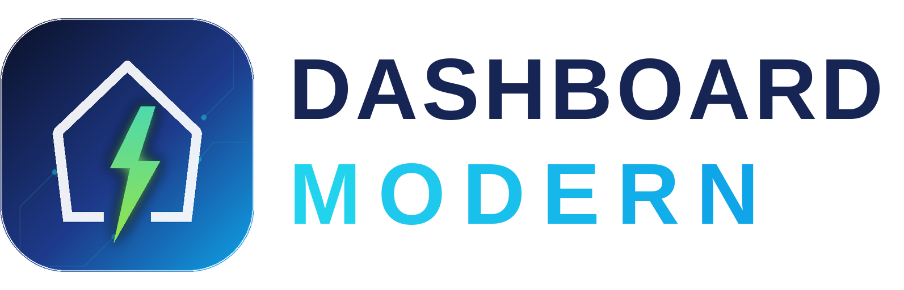

<p align="center">
  
</p>

<h1 align="center">DashboardModern</h1>

<p align="center">
  <b>La dashboard smart-home completa per Home Assistant, come integrazione nativa.</b><br>
  Energia · Fotovoltaico · Auto elettrica · Clima · Luci · Sicurezza · Tapparelle · Irrigazione · Piscina
</p>

<p align="center">
  
  
  
</p>

> **English** — DashboardModern is a full smart-home dashboard for Home Assistant,
> packaged as a native custom integration: sidebar panels (as many as you want,
> each fully isolated), a visual editor with per-section tabs, one-click entity
> auto-detection powered by the HA registries (floors, areas, devices), and a
> navbar that starts minimal and grows as you configure. Install via HACS,
> add the integration, press *Autorilevamento*, done. Docs below are in Italian.

---

## Indice

1. [Cos'è](#cosè)
2. [Installazione](#installazione)
3. [Prima configurazione](#prima-configurazione)
4. [Più plance](#più-plance)
5. [L'editor, tab per tab](#leditor-tab-per-tab)
6. [Autorilevamento](#autorilevamento)
7. [Visibilità delle sezioni e navbar](#visibilità-delle-sezioni-e-navbar)
8. [Sincronizzazione e reset](#sincronizzazione-e-reset)
9. [Diagnostica](#diagnostica)
10. [FAQ](#faq)
11. [Per sviluppatori](#per-sviluppatori)

---

## Cos'è

DashboardModern è una dashboard completa per la casa smart che gira **dentro
Home Assistant come integrazione**: nessun file da copiare in `www/`, nessun
token da generare, nessuna risorsa Lovelace. L'integrazione registra un
pannello nella barra laterale, serve il frontend da un percorso versionato
(le cache si invalidano da sole a ogni aggiornamento) e autentica tramite la
sessione HA già attiva.

Caratteristiche principali:

- **Pannelli multipli** — crei quante plance vuoi, ognuna con il suo nome in
  sidebar e una configurazione **totalmente isolata** (storage e
  sincronizzazione separati per istanza).
- **Editor visuale** — ogni sezione ha la sua scheda: mappi le entità con la
  lente 🔍, salvi, fatto. Niente YAML.
- **Autorilevamento** — un click analizza le entità e i **registri di Home
  Assistant** (piani, aree, dispositivi): stanze e piani si creano da soli, e
  luci, clima e telecamere ereditano la stanza dalla loro area.
- **Navbar intelligente** — a una plancia nuova compaiono solo **Home** e
  **Config**; ogni sezione si accende da sola appena la popoli (e la puoi
  forzare on/off con l'interruttore nella sua scheda).
- **Bilingue** — italiano e inglese.

## Installazione

### Con HACS (consigliato)

1. HACS → menu ⋮ → **Repository personalizzati** → aggiungi
   `https://github.com/danigio15/dashboardmodern-v2` come **Integrazione**.
2. Cerca **DashboardModern**, installa, **riavvia Home Assistant**.
3. *Impostazioni → Dispositivi e servizi → Aggiungi integrazione →
   DashboardModern* → scegli il **nome della plancia** → Invia.
4. La plancia appare nella barra laterale.

### Manuale

Copia la cartella `custom_components/dashboardmodern` dentro
`config/custom_components/`, riavvia, poi aggiungi l'integrazione come sopra.

**Requisiti**: Home Assistant 2025.1 o successivo. Nessuna dipendenza esterna.

## Prima configurazione

Alla prima apertura la plancia mostra il banner *"La dashboard è quasi
pronta!"* e la navbar contiene solo **Home** e **Config**:

1. Tocca **⚙️ Configura la dashboard** (o Config → Configura Entità).
2. In **Impostazioni** premi **🪄 Avvia Autorilevamento**: compila da solo
   luci, stanze, piani, clima, telecamere e collegamenti.
3. Rifinisci nelle schede delle singole sezioni: ogni entità ha la lente 🔍
   per cercarla tra quelle del tuo HA.
4. Le sezioni popolate compaiono da sole nella navbar.

## Più plance

Ripeti *Aggiungi integrazione* per ogni plancia che vuoi (casa, casa dei
genitori, taverna…). Ogni entry ha:

- il **suo pannello** in sidebar (titolo = nome scelto; rinominandola da HA
  pannello e URL si aggiornano da soli);
- **storage e sincronizzazione isolati** — le configurazioni non si toccano
  tra loro;
- le **sue opzioni** (es. *visibile solo agli amministratori*).

La **prima plancia** installata è la *primaria*: mantiene l'URL storico e la
chiave di sincronizzazione storica, quindi chi aggiorna da una versione
precedente non perde nulla.

## L'editor, tab per tab

| Tab | Cosa configuri |
|---|---|
| **⚙️ Impostazioni** | Nome/sottotitolo dashboard, utente admin, **ordine della navbar** (frecce ▲▼), **Autorilevamento** e **Reset totale**, riga di diagnostica |
| **🏠 Home** | Meteo e allarme della schermata principale |
| **⚡ Energia** | Le entità del quadro energia (rete, FV, batteria, casa…), le **viste** da mostrare (istantanea/giornaliera/mensile/report), **costo energia** €/kWh e le voci del **Report Analisi** |
| **🚗 EV** | Entità dell'auto elettrica e **profili multi-auto**: mappa, salva col nome, e con 2+ profili in pagina Auto appare la tendina |
| **🌞 Solare** | Solare termico / boiler |
| **🛡️ Sicurezza** | Allarme **e telecamere** (multi-engine WebRTC/HLS/MJPEG) |
| **🧺 Lavatrice / 🖥️ MiniPC** | Le rispettive entità |
| **🌡️ Temperatura** | Stanze con sensori di temperatura/umidità |
| **⚡ Azioni** | Azioni rapide della Home |
| **❄️ Clima** | Unità climatizzazione, raggruppate per piano/stanza |
| **Carichi** | Prese e carichi monitorati |
| **🏊 Piscina** | Temperatura, pH/cloro, pompa con **programmazione filtrazione** (ore fisse o automatiche in base alla temperatura) |
| **💧 Irrigazione** | Zone sequenziali con durata, orario giornaliero e **salto pioggia** |
| **🪟 Tapparelle** | Cover con card animate, **Apri/Chiudi tutte**, avvisi "aperta" |
| **Stanze / Luci / Elettrodom. / Avvisi** | Registro stanze e piani, gestione luci per stanza, elettrodomestici con soglie di potenza, Quadro Avvisi personalizzato |

In cima a **ogni** scheda di sezione c'è l'interruttore
**🟢 Sezione visibile / ⚪ nascosta** che governa la linguetta in navbar.

## Autorilevamento

Il pulsante in Impostazioni esegue due passaggi:

1. **Scansione entità** — riconosce luci, clima, telecamere, sensori e
   compila le mappature più probabili.
2. **Registri HA** — legge piani (*floor registry*), aree, dispositivi ed
   entità: i piani diventano i tuoi piani, le aree diventano stanze (col loro
   piano) e luci/clima/telecamere ereditano la stanza dell'area. **Non
   sovrascrive mai** ciò che hai impostato a mano: riempie solo i vuoti.

## Visibilità delle sezioni e navbar

- Al primo avvio (nessuna scelta salvata) il motore **deriva la visibilità
  dal contenuto reale**: sezioni popolate visibili, vuote nascoste. Una
  plancia nuova mostra quindi solo Home e Config.
- Quando una sezione **si popola** (mappi uno slot, aggiungi un'unità clima,
  l'autorilevamento trova qualcosa) la sua linguetta **si accende da sola**.
- L'interruttore nella scheda della sezione **vince sempre** sulle regole
  automatiche.
- L'**ordine** delle linguette si cambia da Impostazioni → *Ordine navbar*.

## Sincronizzazione e reset

La configurazione vive nello storage del browser **e** su Home Assistant
(`user_data`), quindi si sincronizza tra i tuoi dispositivi. Ogni plancia usa
la **propria** chiave. **🗑️ Reset totale** (in Impostazioni) azzera solo la
plancia corrente — locale e cloud — e non tocca le altre.

## Diagnostica

In fondo a Impostazioni c'è una riga tipo:

```
v0.12.0-int | hosted:1 | bridge:1 | token:1 | sync:… | inst:01KY… | prim:1 | q:?dmi=… | key:…
```

`inst` è l'istanza di storage della plancia, `prim` se è la primaria, `key`
la chiave di sincronizzazione in uso. Se apri una issue, **allega questa
riga**: dice quasi tutto.

## FAQ

**La navbar mostra una sezione che non uso.** Apri la sua scheda nell'editor
e tocca l'interruttore in cima.

**Ho due plance e voglio configurazioni diverse.** È il comportamento di
default: ogni plancia è isolata. Verifica con la riga di diagnostica che gli
`inst` siano diversi.

**Compare il toast "È disponibile una nuova versione del Frontend".** È di
Home Assistant (il suo frontend), non della dashboard: premi Ricarica.

**Posso usare la vecchia versione file-singolo?** Il progetto storico resta
su [dashboardmodern](https://github.com/danigio15/dashboardmodern); questa
integrazione è la sua evoluzione consigliata.

## Per sviluppatori

```
custom_components/dashboardmodern/
├── __init__.py / config_flow.py     # entry multiple, migrazione primaria
├── frontend.py                      # pannelli per-entry, static versionato
└── frontend/
    ├── panel.js                     # custom element (tag versionato)
    ├── src/legacy/host.js           # mount iframe, ?dmi/?dmp, bridge
    └── legacy/                      # dashboard vendorizzata IT/EN + prelude
scripts/
├── vendor_legacy.py / vendor_features.py   # pipeline patch riproducibile
└── make_logo.py                            # brand rigenerabile
tests/ + frontend/tests/                    # pytest + node:test
```

Il frontend è la dashboard storica **vendorizzata**: `vendor_legacy.py`
applica a monte le patch dichiarate in `vendor_features.py` (ancore esatte,
fail-fast, build byte-riproducibile). Test: `pytest` (integrazione) e
`node --test` (bridge, storage namespace, motore navbar eseguito estratto dal
file servito). Le release seguono [SemVer](https://semver.org): vedi
[CHANGELOG.md](CHANGELOG.md).

---

<p align="center">Fatto con ⚡ a Napoli · <a href="https://github.com/danigio15/dashboardmodern-v2/issues">Segnala un problema</a></p>
